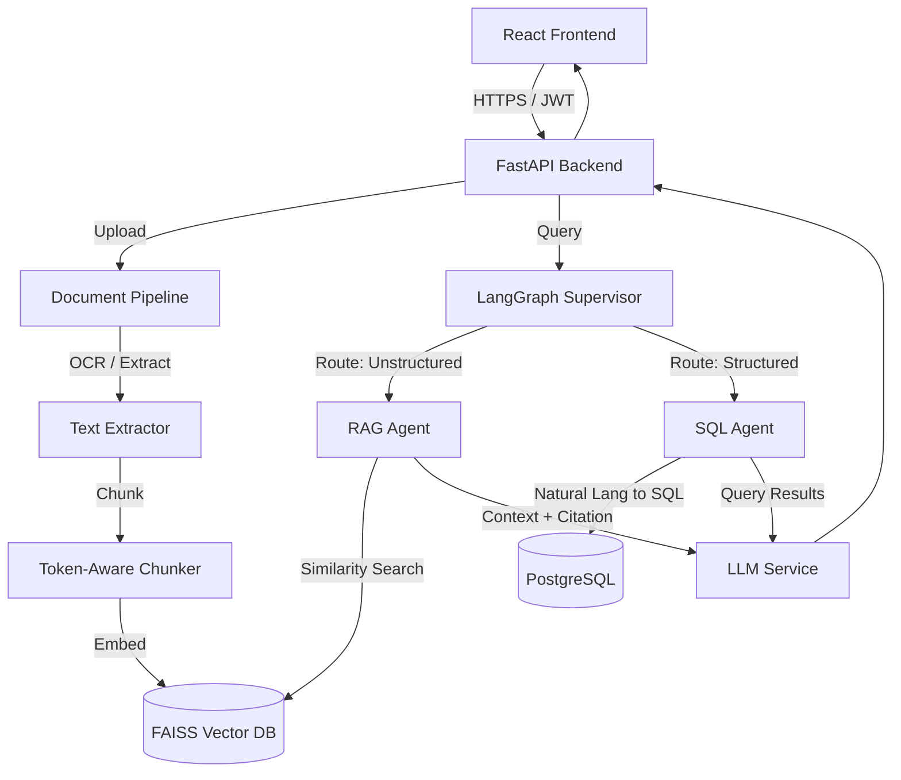

# Enterprise Multi-Agent RAG Research Assistant

An enterprise-grade, multi-agent AI research assistant built with LangGraph, FastAPI, and React. This system ingests documents, processes them using a state-of-the-art token-aware chunking and OCR pipeline, and stores embeddings in a vector database (FAISS/ChromaDB). It utilizes a LangGraph-powered **Supervisor Agent** to intelligently route user queries to specialized sub-agents (RAG Document Search vs. SQL Database querying).

## 🌟 Key Features

* **Intelligent Agent Routing:** Uses LangGraph to orchestrate a Supervisor agent that routes natural language queries to either a RAG-based document search agent or a structured SQL query agent.
* **Robust Document Processing:** Supports PDF, DOCX, TXT, and CSV uploads with PyMuPDF text extraction, Tesseract OCR fallback for scanned images, and LangChain RecursiveCharacterTextSplitter for optimal chunking.
* **Hybrid Search Engine:** Combines dense semantic vector search (HuggingFace embeddings via FAISS) with sparse keyword search foundations.
* **Enterprise Security & Auth:** Stateless JWT-based authentication, bcrypt password hashing, and strict vector isolation (namespaces mapped to User IDs) ensuring tenant data privacy.
* **Modern React UI:** Fully responsive, polished dashboard and chat interface with typing indicators, agent-usage badges, and exact-source citations.
* **Production-Ready Infrastructure:** Fully Dockerized architecture with Nginx reverse proxy, asynchronous SQLAlchemy 2.0 with PostgreSQL, global exception handling, and CI/CD pipelines via GitHub Actions.

## 🏗️ System Architecture



## 🚀 Quick Start (Docker)

The fastest way to run the application locally is using Docker Compose.

1. **Clone the repository:**
   ```bash
   git clone https://github.com/krishnaanand07/enterprise-rag-assistant.git
   cd enterprise-rag-assistant
   ```

2. **Set up Environment Variables:**
   Copy the example environment file and fill in your API keys (e.g., Google Gemini or OpenAI).
   ```bash
   cp backend/.env.example backend/.env
   ```

3. **Spin up the containers:**
   ```bash
   docker-compose up --build
   ```

4. **Access the application:**
   * Frontend: `http://localhost:3000`
   * Backend API Docs: `http://localhost:8000/docs`

## 📖 Comprehensive Implementation Guide

This repository includes a highly detailed, 37-chapter implementation handbook that documents every architectural decision, code block, and deployment strategy used to build this system. 

It is designed to serve as both documentation and an interview study guide.

**[Read the full IMPLEMENTATION.md Guide here](docs/IMPLEMENTATION.md)**

## 🛠️ Tech Stack

**Backend**
* Python 3.11+
* FastAPI & Uvicorn (Async ASGI)
* LangChain & LangGraph
* SQLAlchemy 2.0 (asyncpg) & Alembic
* PostgreSQL
* FAISS (Vector Store)

**Frontend**
* React 18 (Vite)
* Tailwind CSS
* React Router DOM
* Axios (with Interceptors)

**DevOps & Deployment**
* Docker & Docker Compose
* Nginx Reverse Proxy
* GitHub Actions (CI)
* Render (Backend PaaS) & Vercel (Frontend CDN)

 
